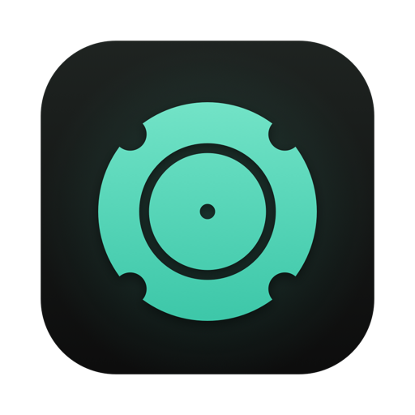
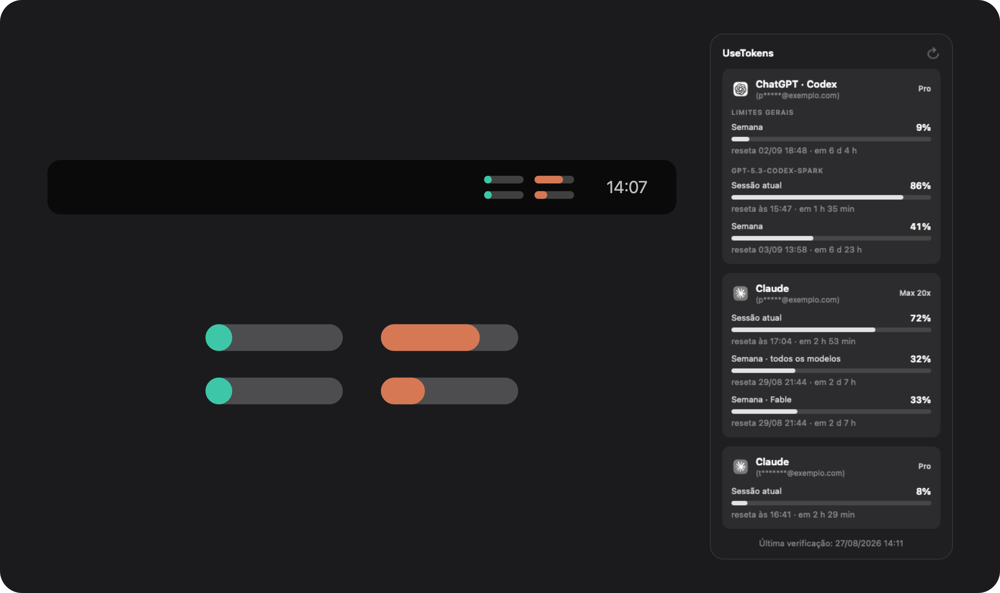
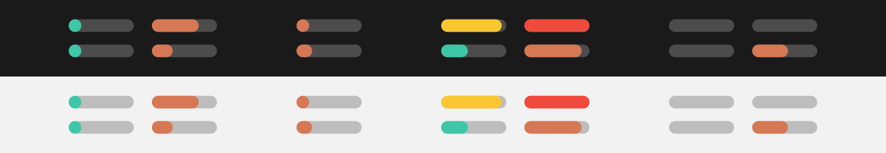

<div align="center">



# UseTokens

**How much of your AI plan is gone, in the menu bar.**

[nasmac.app](https://nasmac.app) · [Português](README.md) · [Download](https://nasmac.app/downloads/UseTokens.dmg)



</div>

---

Free, no account, no ads, no paid tier. It shows what you have spent on ChatGPT (Codex) and Claude: bar, percentage, time left until the reset, and when the reading was taken.

The menu bar carries two small bars per service — the current session on top, the week below — so you can tell where you stand without opening anything.

One account each, or several — the app finds every signed-in one on its own and gives each a card, labelled with a masked e-mail.

## Why it exists

Finding out your limit ran out in the middle of a task is annoying, and both companies keep that number a few clicks deep, on different screens. I wanted to glance at the menu bar and know.

## Privacy

This is the part that matters, so it comes before everything else.

- **There is no server.** No backend, no account, no telemetry. Nothing about you leaves your Mac.
- **Nothing is baked into the build.** No key, no token, no identifier ships inside the app.
- **It does not crack anyone's encrypted vault.** The app never opens the Claude or ChatGPT secure storage, and never refreshes a third-party credential — refreshing would rotate the token and sign you out of those apps.
- **What it reads:** the usage number Claude Code hands over through its official status line mechanism, the file the Claude app writes to your disk, `~/.claude.json` — Claude Code's own configuration, from which it takes only *which account is signed in and which plan it is on*: identity, not a credential, with no token anywhere in it — and Codex's `auth.json` so it can call OpenAI's API straight from your computer.
- **What it writes:** percentages and timestamps only, in `~/Library/Application Support/UseTokens`. The Claude Code payload is filtered before it touches disk — session id, working directory and transcript path are dropped.

The code is all here. `ClaudeProvider.swift`, `ClaudeStatusLine.swift` and `CodexProvider.swift` are the files that talk to the outside world.

## Where the numbers come from

**Claude.** The main source is Claude Code's *status line* — the official, documented mechanism where Claude Code hands your own command, on stdin, the JSON it draws its own status bar with. That JSON carries `rate_limits.five_hour` and `rate_limits.seven_day`, each with a percentage and an exact reset time. UseTokens registers a three-line script as that command, preserving any status line you already had (it keeps being drawn as usual). Turn the setting off and your `~/.claude/settings.json` goes back exactly as it was.

Worth knowing: **only Claude Code in a terminal draws a status line.** The Claude desktop app has none, so working entirely inside it feeds nothing to this source.

As a fallback the app reads `plan-usage-history.json`, which the Claude app writes on its own. Plain JSON, no token involved — but the Claude app only samples under certain conditions, so that reading gets old.

**An old reading never becomes a bar in the menu bar.** Past 30 minutes it drops out of the icon, and the card shows the last one there was with its age spelled out next to it ("read 3 d ago"), along with how to get a current one. Repeating a percentage from hours ago as though it were now is the one thing this app must not do.

**ChatGPT / Codex.** Calls `chatgpt.com/backend-api/wham/usage` with the credential the Codex CLI already saved in `~/.codex/auth.json`, straight from your Mac. It returns the general limits and the per-model ones too, each with its own window and reset.

If neither service has a signed-in session, that service's card simply does not appear.

## Install

Download the [DMG](https://nasmac.app/downloads/UseTokens.dmg) — and **don't open it yet**.

macOS blocks the downloaded file, because the app is not notarized by Apple yet: notarization requires the paid developer program. Before opening it, run this in Terminal, using the name of the file you downloaded:

```bash
xattr -dr com.apple.quarantine ~/Downloads/UseTokens*.dmg
```

Now open the .dmg and drag the app to your Applications folder. Nothing else is needed — an app that comes out of a cleared .dmg does not carry the flag.

That command only removes the "downloaded from the internet" flag your browser puts on the file. It does not modify the app or disable any macOS protection. If you already opened the .dmg before running the command, run it on `/Applications/UseTokens.app` too.

## Settings

- **Launch at login** and **update automatically** — on by default.
- **Read Claude Code usage** — registers the status line described above. On by default, reversible any time.
- **Show usage in the menu bar** — the bars instead of the plain icon. On by default.
- **Refresh every** — 5, 15, 30 or 60 minutes.
- **Notify when limits reset** — a short sound when a spent limit rolls back to zero.
- **Language** — English or Portuguese.



Each service gets two bars: the current session on top, the week below. They carry the service's colour up to 89%, turn yellow from 90% to 99%, and red at 100%. No numbers: at that size a number cannot be read and a bar can. Turn the bars off and the plain icon comes back, with a warning dot on the same colour scale.

## Build from source

You only need Apple's Command Line Tools — no full Xcode install.

```bash
git clone https://github.com/vprotti/usetokens.git
cd usetokens
./scripts/build.sh
```

You get `dist/UseTokens.app`, universal (Apple Silicon and Intel). For the installer, `./scripts/dmg.sh`.

Built-in checks, handy while changing the code:

```bash
./dist/UseTokens.app/Contents/MacOS/UseTokens --selftest-statusline /tmp/scratch
./dist/UseTokens.app/Contents/MacOS/UseTokens --selftest-ui /tmp/popover.png
```

The first one exercises installing and uninstalling the status line against a throwaway directory, checking that no configuration key is lost along the way.

Signing: with nothing configured the build signs ad-hoc. With a Developer ID certificate, export `DEVELOPER_ID` and `NOTARY_PROFILE` and `scripts/sign.sh` handles signing, notarization and stapling.

## Layout

```
Sources/UseTokens/ClaudeStatusLine.swift   the bridge to Claude Code's status line
Sources/UseTokens/ClaudeProvider.swift     Claude's sources, in order
Sources/UseTokens/CodexProvider.swift      ChatGPT usage API
Sources/UseTokens/Accounts.swift           finds signed-in accounts, masks e-mails
Sources/UseTokens/SelfTest.swift           checks and image rendering
scripts/build.sh                           universal build + bundle
```

No external dependencies.

## Contributing

Bug, idea or question: [open an issue](https://github.com/vprotti/usetokens/issues). Pull requests are welcome — please read [CONTRIBUTING](CONTRIBUTING.md) first.

Both companies change these formats without warning. If you see a number that looks wrong or a card that vanished, an issue with what showed up on screen helps a lot.

If UseTokens saved you some time, a ⭐ on the repo helps other people find it. Takes a second and costs nothing.

If you would rather give back another way, I accept Bitcoin — the app stays free either way:

```
bc1qs27wszjtkhku08nkmth4ctykyk9pa2nrfa2nlw
```

## License

[MIT](LICENSE). Use it, change it, ship it, including commercially.

Not affiliated with Anthropic or OpenAI. Those names and marks belong to their companies.

---

<div align="center">
Built by <a href="https://viniciusprotti.com.br">Vinicius Protti</a> · <a href="https://nasralla.com.br">Nasralla Serviços Digitais</a><br>
More free Mac apps at <a href="https://nasmac.app"><strong>nasmac.app</strong></a>
</div>
