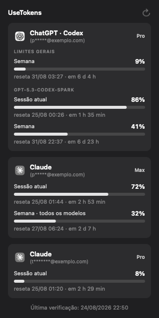

<div align="center">


# UseTokens

**Quanto do seu plano de IA já foi, na barra de menus.**

[nasmac.app](https://nasmac.app) · [English](README.en.md) · [Baixar](https://nasmac.app/downloads/UseTokens.dmg)



</div>

---

Grátis, sem conta, sem anúncio, sem versão paga. Mostra o consumo do ChatGPT (Codex) e do Claude: barra, porcentagem, quanto falta para resetar e quando foi a última leitura.

Uma conta de cada, ou várias — o app acha sozinho todas as que estiverem logadas e mostra um card para cada, identificado pelo e-mail mascarado.

## Por que existe

Descobrir que o limite acabou no meio de uma tarefa é irritante, e as duas empresas escondem esse número atrás de alguns cliques em telas diferentes. Eu queria olhar para a barra de menus e saber.

## Privacidade

Isto é a parte importante, então vem antes do resto.

- **Não existe servidor.** O app não tem backend, não tem conta, não tem telemetria. Nada seu sai do seu Mac.
- **Nada embutido no build.** Não vai chave, token nem identificador dentro do app.
- **Não lê cofre criptografado de ninguém.** O app não abre o armazenamento seguro do app do Claude nem do ChatGPT, e nunca renova credencial de terceiro — renovar rotacionaria o token e derrubaria a sua sessão nesses apps.
- **O que ele lê:** o número de uso que o Claude Code entrega pelo mecanismo oficial de status line, o arquivo que o app do Claude grava no seu disco, e o `auth.json` do Codex para consultar a API da OpenAI direto do seu computador.
- **O que ele grava:** só porcentagens e horários, em `~/Library/Application Support/UseTokens`. O payload do Claude Code é filtrado antes de tocar o disco — id de sessão, diretório de trabalho e caminho de transcrição são descartados.

O código está todo aqui. `ClaudeProvider.swift`, `ClaudeStatusLine.swift` e `CodexProvider.swift` são os arquivos que falam com o mundo lá fora.

## De onde vêm os números

**Claude.** A fonte principal é a *status line* do Claude Code — o mecanismo oficial e documentado em que o Claude Code entrega, no stdin de um comando seu, o JSON que ele usa para desenhar a própria barra de status. Esse JSON traz `rate_limits.five_hour` e `rate_limits.seven_day` com a porcentagem e o horário exato de reset. O UseTokens registra um script de três linhas como esse comando, preservando qualquer status line que você já tivesse (ela continua sendo desenhada normalmente). Desligue a opção nos Ajustes e o seu `~/.claude/settings.json` volta exatamente como estava.

Como reserva, o app lê `plan-usage-history.json`, que o app do Claude grava sozinho. É JSON puro, sem token — mas o app do Claude para de amostrar quando a máquina fica ociosa, então essa leitura envelhece. **Leitura velha não vira número na tela:** passando de 30 minutos, o card diz que não tem leitura atual em vez de repetir uma porcentagem de horas atrás.

**ChatGPT / Codex.** Consulta `chatgpt.com/backend-api/wham/usage` com a credencial que o Codex CLI já salvou em `~/.codex/auth.json`, direto do seu Mac. Devolve os limites gerais e também os limites por modelo, cada um com a própria janela e reset.

Se não houver nenhuma sessão logada de um dos dois, o card daquele serviço simplesmente não aparece.

## Instalar

Baixe o [DMG](https://nasmac.app/downloads/UseTokens.dmg), arraste para a pasta Aplicativos.

Na primeira abertura o macOS bloqueia, porque o app ainda não é notarizado pela Apple — a notarização depende do programa pago de desenvolvedor. Rode uma vez no Terminal:

```bash
xattr -dr com.apple.quarantine /Applications/UseTokens.app
```

Esse comando só remove a marca de "baixado da internet" que o navegador coloca no arquivo. Não altera o app nem desliga proteção nenhuma do macOS.

## Ajustes

- **Iniciar com o Mac** e **atualizar automaticamente** — ligados por padrão.
- **Ler o uso do Claude Code** — registra a status line descrita acima. Ligado por padrão, reversível a qualquer momento.
- **Atualizar a cada** — 5, 15, 30 ou 60 minutos.
- **Notificar quando resetar** — som curto quando um limite estourado volta a zero.
- **Idioma** — português ou inglês.

O ícone na barra fica na cor do app, ganha um ponto amarelo entre 90% e 99%, e vermelho ao bater 100%.

## Compilar do código

Precisa só das Command Line Tools da Apple — não precisa do Xcode completo.

```bash
git clone https://github.com/vprotti/usetokens.git
cd usetokens
./scripts/build.sh
```

O resultado é `dist/UseTokens.app`, universal (Apple Silicon e Intel). Para o instalador, `./scripts/dmg.sh`.

Verificações embutidas, úteis ao mexer no código:

```bash
./dist/UseTokens.app/Contents/MacOS/UseTokens --selftest-statusline /tmp/scratch
./dist/UseTokens.app/Contents/MacOS/UseTokens --selftest-ui /tmp/popover.png
```

A primeira exercita instalar e desinstalar a status line contra um diretório descartável, conferindo que nenhuma chave de configuração se perde no caminho.

Assinatura: sem configurar nada, o build assina ad-hoc. Com um certificado Developer ID, exporte `DEVELOPER_ID` e `NOTARY_PROFILE` e o `scripts/sign.sh` cuida da assinatura, notarização e staple.

## Estrutura

```
Sources/UseTokens/ClaudeStatusLine.swift   ponte com a status line do Claude Code
Sources/UseTokens/ClaudeProvider.swift     as fontes do Claude, em ordem
Sources/UseTokens/CodexProvider.swift      API de uso do ChatGPT
Sources/UseTokens/Accounts.swift           acha as contas logadas, mascara e-mails
Sources/UseTokens/SelfTest.swift           verificações e renderização das imagens
scripts/build.sh                           build universal + bundle
```

Sem dependências externas.

## Contribuir

Bug, ideia ou dúvida: [abra uma issue](https://github.com/vprotti/usetokens/issues). Pull requests são bem-vindos — leia o [CONTRIBUTING](CONTRIBUTING.md) antes.

As duas empresas mudam esses formatos sem avisar. Se você vir um número estranho ou um card sumido, uma issue com o que apareceu na tela ajuda muito.

Se o UseTokens te poupou tempo, uma ⭐ aqui no repositório ajuda outras pessoas a encontrarem o projeto. Leva um segundo e não custa nada.

Se quiser retribuir de outro jeito, aceito Bitcoin — mas o app continua grátis de qualquer forma:

```
bc1qs27wszjtkhku08nkmth4ctykyk9pa2nrfa2nlw
```

## Licença

[MIT](LICENSE). Use, modifique e redistribua à vontade, inclusive comercialmente.

Não tem relação com a Anthropic nem com a OpenAI. Os nomes e marcas são de cada empresa.

---

<div align="center">
Feito por <a href="https://viniciusprotti.com.br">Vinicius Protti</a> · <a href="https://nasralla.com.br">Nasralla Serviços Digitais</a><br>
Mais apps grátis para Mac em <a href="https://nasmac.app"><strong>nasmac.app</strong></a>
</div>
